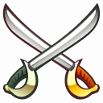

# K-Atlas

## What It Does?

**K-Atlas** \(_pronounced **Cutlass**_\), is a distributed graph based platform to automatically collect, discover, explore and relate multi-cluster Kubernetes resources and metadata. The system will have a rich query language that will allow for simple and efficient exploration and extensibility.

It addresses following problems in an enterprise environment of Kubernetes.

* **Discoverability**
  * Find K8s objects across multiple distributed K8s clusters
  * Real-time view discovered objects
  * Streaming APIs and UI for programmatic and human interactions
* **Advanced Exploration**
  * Identify similarities and differences between objects from pods to clusters
  * In depth analysis of individual characteristics like performance
* **Federated Application View**
  * Take an application centric view - correlate an application’s metadata across multiple clusters
* **Reporting**
  * Provide advanced reporting on compliance, security and other organizational policies
* **Policy Enforcement**
  * Allow for organizational policies to be enforced across the fleet in a consistent manner

Check out more details on [Motivation and Use Cases](docs/motivation.md) that K-Atlas is addressing.

It provides a Web Viewer that can be used to search the Kubernetes cluster data and view graphical results in real time. Click [here to see a demo](https://www.useloom.com/share/eb97aa1054004be197e3ed732223e689).

## Core Components

#### Collector

The collector is responsible for discovery of Kubernetes assets in Kubernetes Clusters. For details on the  Collector design, please refer [Design Concepts](docs/design-concepts.md)

#### K-Atlas Service

The K-Atlas Service exposes APIs that can be used to get details about Kubernetes entities and run queries to help diagnose issues in Kubernetes clusters. For details , please refer [K-Atlas APIs](docs/rest-apis.md) 

#### Web Application

The Web Application exposes UI search capability to search clusters based on several criteria and provide a real time graphical view of entities. For details on usage, please Click [here to see a demo](https://www.useloom.com/share/eb97aa1054004be197e3ed732223e689)

#### Database

Dgraph is used as the graph database. To know more about our motivation to choose Dgraph, please refer [Design Concepts](docs/design-concepts.md)

## Deploying to a Cluster

### Technical Requirements

Make sure you have the following prerequisites:

* A local Go 1.7+ development environment.
* Access to a Kubernetes cluster.

### Setup Steps

How to [Set Up](docs/installation.md).

## Roadmap

#### v0.5

* [x] Support for Kubernetes resource collecting and store in graph database
* [x] View graphical and tabular results in real time

More releases at [Release Notes](release.md).

## Contributing

We encourage you to get involved with K-Atlas, as users or contributors and help with code reviews.

Read the [contributing guidelines](docs/contributing.md) to learn about building the project, the project structure, and the purpose of each package. 

